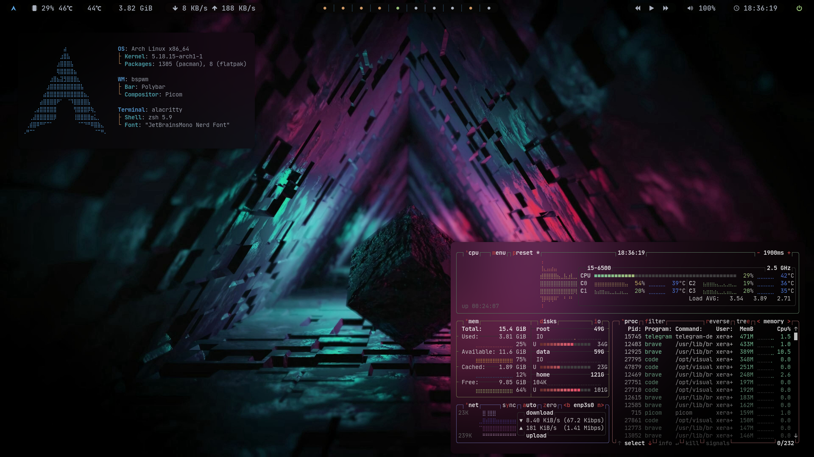

# Dotfiles

### My current system configurations

| [OS](# "Operative System")           | [WM](# "Window Manager")                      | Bar                                           | Compositor                                 |
| ------------------------------------ | --------------------------------------------- | --------------------------------------------- | ------------------------------------------ |
| [Arch Linux](https://archlinux.org/) | [bspwm](https://github.com/baskerville/bspwm) | [Polybar](https://github.com/polybar/polybar) | [Picom](https://github.com/ibhagwan/picom) |

| Terminal                            | Shell                       | Font                                                  |
| ----------------------------------- | --------------------------- | ----------------------------------------------------- |
| [Alacritty](https://alacritty.org/) | [Zsh](https://www.zsh.org/) | [JetBrainsMono Nerd Font](https://www.nerdfonts.com/) |

- [Installation](./installation.md)
- [Packages](./package.md)
- [GTK3 Theme](https://www.gnome-look.org/p/1357889/)
- [Icons Theme](https://www.gnome-look.org/p/1279924/)
- [Cursor](https://www.gnome-look.org/p/1360254/)
- [Grub Theme](https://www.pling.com/p/1603282/)
- [Editors](./editos.md)

### Desktop

#### [Last commit in NixOS](https://github.com/adrianrl99/dotfiles/tree/7db2d1594b2f9e441d2b018d7bb896e1714d1016)

#### [First time in Arch Linux](https://github.com/adrianrl99/dotfiles/tree/274735741832d0dcc8b6bf962f42d0b52122921f)
