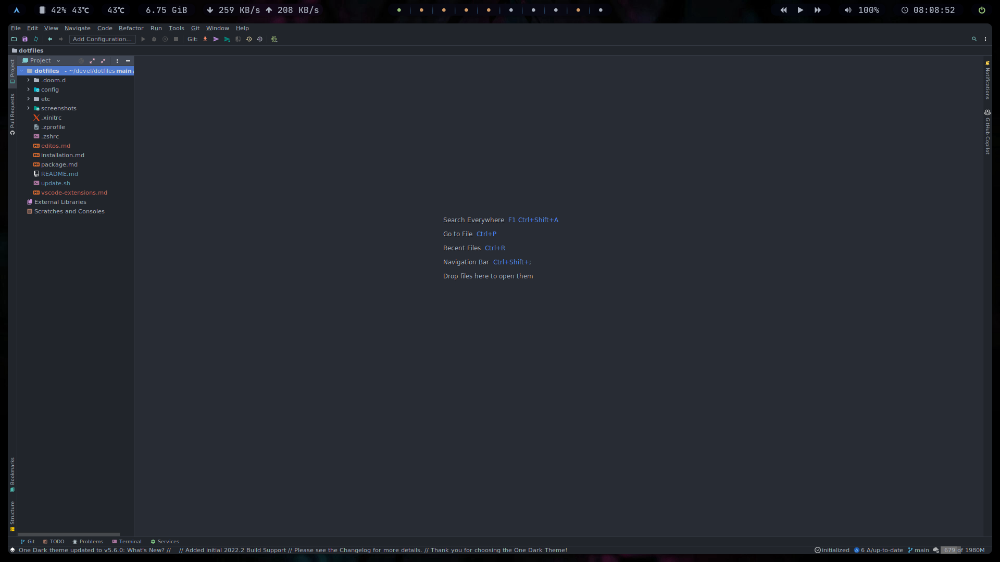
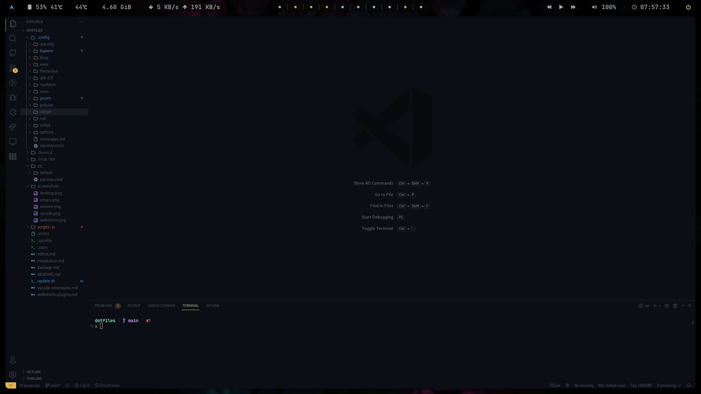
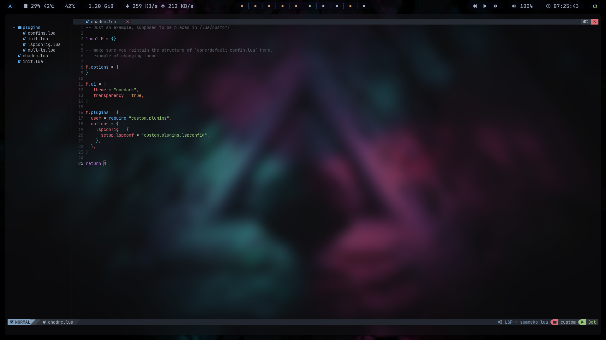
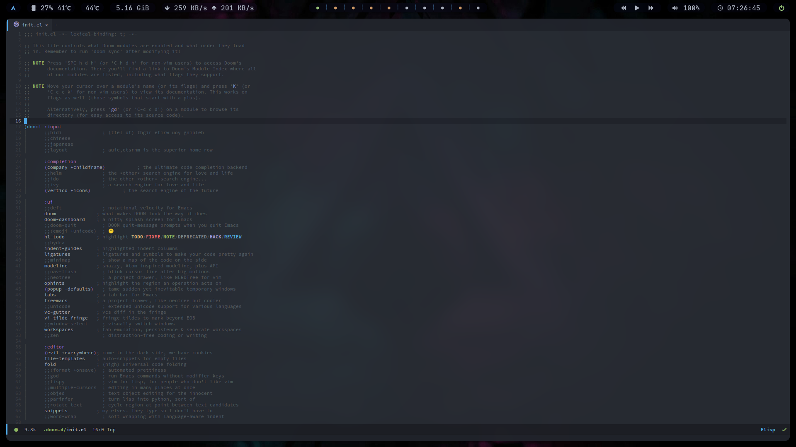

# Editos

### [WebStorm](https://www.jetbrains.com/webstorm/)

### [VS Code](https://code.visualstudio.com/)

- [Extensions](./vscode-extensions.md)
- [Configuration](./config/Code/User/settings.json)

### [NeoVim](https://neovim.io/) with [NvChad](https://nvchad.github.io/)

- [Configuration](./config/nvim/lua/custom/)

### [Emacs](https://www.gnu.org/software/emacs) with [Doom Emacs](https://github.com/doomemacs/doomemacs)

- [Configuration](./.doom.d)

